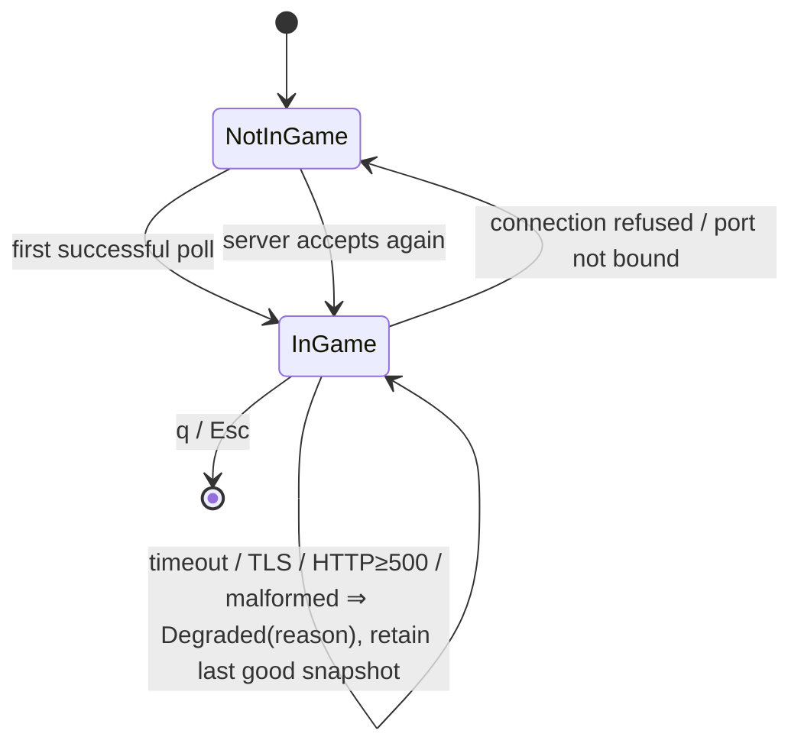

# Design: add-live-match-dashboard

**Change**: `add-live-match-dashboard` · **Date**: 2026-08-25 · **Basis**: amended proposal, specs `live-client-poller` + `live-dashboard-ui`, exploration.md, config.yaml (Rust 1.98 edition 2024, ratatui 0.30.2, crossterm 0.29.0, builds on E:, `-j 1`).

## Technical Approach

Extend the greenfield single-crate scaffold into four layers: `api` (loopback TLS poller), `model` (tolerant serde DTOs → normalized snapshot), `app` (lifecycle FSM + message pump), `ui` (standby, dashboard, ticker, status). One poller thread samples `/liveclientdata/allgamedata` at a clamped 250–1000 ms cadence, strictly non-overlapping; results flow over an mpsc channel that the render loop drains latest-wins each frame. Live-only; zero persistence.

## Architecture Decisions

| # | Decision | Choice | Alternatives rejected | Rationale |
|---|---|---|---|---|
| D1 | Polling shape | Single aggregate `GET /liveclientdata/allgamedata` per tick | Per-endpoint calls (`/playerlist`, `/eventdata`, `/gamestats`) | Tens-of-KB at ≤1 Hz loopback is negligible; one call carries playerlist+events+gamestats; one failure domain simplifies lifecycle classification. Client still implements all four endpoint paths (spec mandate) for future use. |
| D2 | HTTP/TLS | Hand-rolled blocking reqwest + rustls, `riotgames.pem` embedded via `include_bytes!` into the root store | `lol-game-client-api` crate; default `danger_accept_invalid_certs` | That crate is thin, v0.1.x, patchy maintenance, and couples us to its strict models — we need tolerant deserialization regardless. Pinning Riot's published root is the compliance-safe pattern; insecure fallback only behind explicit opt-in flag (spec MAY). ~100 LOC client. |
| D3 | Concurrency | std::thread + std::sync::mpsc + reqwest blocking; no async runtime | Full tokio | One 1 Hz local source plus a UI tick does not justify runtime weight. Blocking gives deterministic scheduling, fewer deps, readable backtraces; crossterm events polled inline per frame. |
| D4 | Lifecycle FSM | `NotInGame` ∨ `InGame { health: Healthy \| Degraded(reason) }` | Flat three-state NOT_IN_GAME/IN_GAME/DEGRADED | Spec requires transient failures to *keep* IN_GAME, so DEGRADED is a health annotation inside InGame (stale-snapshot banner), never a standby transition. Only conn-refused/port-unbound leaves InGame. |
| D5 | Testability seams | `HttpSource` trait (fetch→Result\<String\>), `Clock` trait (now/sleep_until), pure `Snapshot` as api↔ui seam | Concrete reqwest types in logic; real sleeps in tests | Offline determinism per spec: FakeClock proves non-overlap/clamp; UI tests build snapshots directly, network-free. |

## Data Flow

```mermaid
sequenceDiagram
    participant R as Game client :2999
    participant P as Poller thread (api)
    participant C as mpsc channel
    participant M as Main thread (app+ui)
    loop non-overlapping, clamped 250–1000 ms
        P->>R: GET /liveclientdata/allgamedata (pinned-cert TLS)
        R-->>P: JSON body | refused | timeout | garbage
        P->>P: classify error → normalize → Snapshot
        P->>C: PollMsg {Snapshot | Lifecycle | Transient(reason)}
        P->>P: sleep remaining cadence (Clock)
    end
    M->>C: drain each frame, keep latest
    M->>M: FSM update → draw dashboard|standby + ticker + status; q/Esc exit; resize redraw
```

## Lifecycle State Diagram



## Module Layout (target — all Create unless noted)

| Path | Action | Role |
|---|---|---|
| `src/main.rs` | Modify | entry; terminal init/teardown; panic-safe restore |
| `src/app.rs` | Create | App state, lifecycle FSM, message pump |
| `src/events.rs` | Create | crossterm input/resize handling |
| `src/api/{client,poller,source,error}.rs` | Create | pinned-cert client + loopback guard; scheduler; HttpSource; error taxonomy |
| `src/model/{live_data,snapshot}.rs` | Create | tolerant DTOs (`Option` everywhere); normalized Snapshot |
| `src/ui/{mod,standby,dashboard,ticker,status}.rs` | Create | views; status carries notice + lifecycle + last-update |
| `tests/fixtures/allgamedata/*.json` | Create | recorded payloads: full, partial_player, empty_events, malformed |
| `assets/riotgames.pem` | Create | vendored Riot root (SHA-256 + source URL in provenance comment) |
| `Cargo.toml` | Modify | + serde, serde_json, reqwest (blocking, rustls-tls), thiserror |

## Error Taxonomy ↔ Spec Scenarios

| Condition | Class | FSM effect | UI behavior |
|---|---|---|---|
| Conn refused / port unbound | NotBound | → NotInGame | standby view, silent, no error loop |
| Timeout | Transient(Timeout) | stays InGame·Degraded | stale-data banner + last snapshot |
| TLS/trust failure | Transient(Tls) | stays InGame·Degraded | status-line reason |
| HTTP ≥500 / odd status | Transient(Http) | stays InGame·Degraded | status-line reason |
| Malformed JSON | Transient(Parse) | stays InGame·Degraded | previous snapshot retained |
| Non-loopback host configured | fatal at construction | n/a | startup fails before any packet |
| Cadence outside 250–1000 ms | clamped into range | n/a | — |

## Terminal Handling

Raw mode + alternate screen entered at startup; restoration guaranteed by a Drop guard **and** a panic hook (restore, then resume unwinding) so a panic cannot orphan a broken console. Targets: Windows Terminal and classic conhost. `q`/`Esc` → exit status 0; Resize → next frame drawn within new bounds, notice still visible.

## Compliance

Status bar renders the exact "not endorsed by Riot Games" notice persistently in every view (single `RIOT_NOTICE` constant). Hard rule: **no derived timers anywhere in model/api code** — respawn shows the exposed value or an explicit unknown marker; gold renders only for the local player; ticker uses exposed `EventTime` values verbatim. No countdown is ever computed from `gameTime`. Enforced by review checklist task.

## Testing Strategy

| Layer | What to Test | Approach |
|---|---|---|
| Unit | error→class mapping; absent/null = absent semantics; scheduler non-overlap + slow-response serialization + clamp (FakeClock); DTO tolerance | fixture strings inline + corpus |
| Integration | corpus → Snapshot → rendered buffer assertions (10 panels by team, per-field placeholders, local-gold exclusivity, dead-player unknown marker, ticker incl. stolen DragonKill, empty-events placeholder, notice in both views); shrink-resize; malformed retains prior | ratatui TestTerminal buffers |
| Manual/E2E | positive TLS accept vs live game; mid-game disconnect/reconnect; quit restores terminal | documented checklist |

Honest limitation: automated *positive* TLS acceptance is impossible offline (Riot's root private key is unavailable); the suite asserts trust-store fingerprint of the embedded pem and rejects an `rcgen`-generated untrusted chain; live acceptance is manual-checklist verified.

## Threat Matrix

N/A — no routing, shell, subprocess, VCS/PR automation, executable-file classification, or process-integration boundary. Sole egress is one fixed loopback URL whose host is validated at construction (covered by the construction-guard unit test above).

## Migration / Rollout

None required (greenfield). Slices land as independent conventional commits; revert any slice in isolation; no migrations or external state.

## Open Questions

- [ ] Confirm vendoring `riotgames.pem` in-repo (with SHA-256 provenance) vs fetching at build time — default: vendor.
- [ ] Verify legacy conhost renders alt-screen acceptably; fallback degrades colors, never features.
