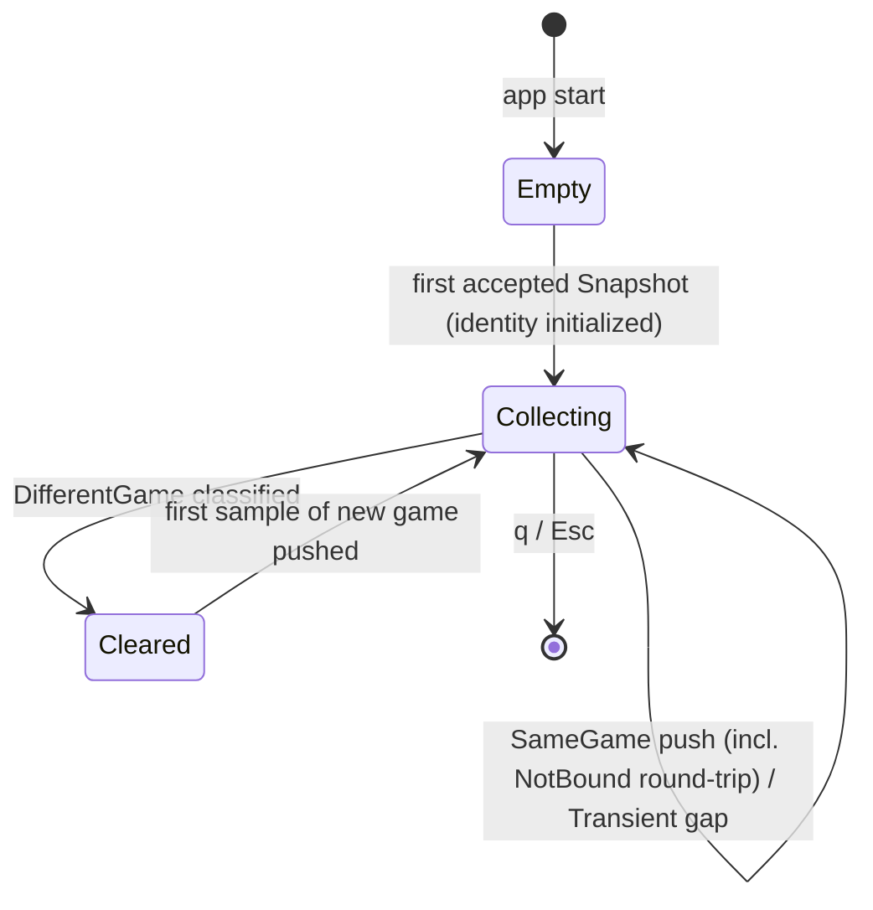

# Design: add-live-visualizations

**Change**: `add-live-visualizations` · **Date**: 2026-08-25 · **Basis**: exploration.md (Approach B), proposal, spec `live-dashboard-visualizations`, archived `add-live-match-dashboard` conventions, config.yaml rules.design.

## Technical Approach

Replace the `Pen` line-cursor with a `Layout`-region shell hosting native ratatui 0.30 widgets (horizontal BarChart, Sparkline, LineGauge, inline glyph strips). Two new leaf modules: `src/glyphs.rs` (whitelist sole source) and `src/history.rs` (ring buffer + game identity + truncation helper). The app layer folds accepted snapshots into history; the poller stays frame-pure. Slices S1–S11 per proposal; S2 extracts the layout behavior-preserving before any widget lands.

## Architecture Decisions

| # | Decision | Choice | Alternatives rejected | Rationale |
|---|---|---|---|---|
| D1 | Different-game identity | Per accepted Snapshot: `gameTime` decrease > 5.0 s ⇒ new game; else `gameMode` change (both present); else same game | Roster name-set diff (`summoner_name` is `Option` — absence storms); `riotIdGameName` (unmodeled DTO churn); raw decrease (jitter false-wipes) | Fields already normalized in `GameInfo`; real new games are minutes apart so tolerance cannot miss one; conservative default never destroys history on degraded payloads. |
| D2 | Region layout | Vertical `[Length(1) header, Min(5) body, Length(2–3) local, Min(1) ticker, Length(1) status]`, status LAST. Anchor 80×24 below; 80×12 drops chart tiers (D9), body falls back to text rows | Pen cursor (cannot host widgets); Canvas-first grid (exploration rejection) | Disjoint Rects make R6 structural: no widget can overwrite the notice row. |
| D3 | Widget mapping | Table below | Hand-rolled ASCII bars in strings (duplicated scaling logic) | Library primitives own scaling/styling; one shared-max rule for counters. |
| D4 | Ring buffer | `src/history.rs`: `RingBuffer<T, 120>` array-backed, preallocated, O(1) push, capacity never grows; sole instantiation `GoldHistory = RingBuffer<u64, 120>` (≈ 1.9 KiB ≪ 32 KiB). Fed from `App::on_msg`: Snapshot ⇒ sample, Transient-in-game ⇒ `None` gap; lifecycle never touches it | Buffer in poller (breaks frame purity); growing `VecDeque`; Clock inside buffer — event-indexed, explicit pushes give determinism | N=120 = spec's ~2 min @ 1 Hz exactly; app-side feeding leaves the poller spec untouched. |
| D5 | f64→u64 policy | One helper `chart_u64(f64) -> Option<u64>`: non-finite ⇒ `None`; else truncate toward zero, saturate at 0 (finite-guarded `as`). Sole path for CS + gold samples; integer counters bypass it | `floor`, `round`, per-widget casts | Spec pins truncate/saturate/non-finite→absent; one named function makes drift impossible. |
| D6 | Warm-up | < 2 `Some` points ⇒ text `warming up (n/120)`; ≥ 2 ⇒ draw partial window; `None` samples render as breaks (Sparkline absent-value) | Flat line (< 2 pts reads as zero trend — spec-forbidden); blocking until full | Gap and absent-gold unify as `None` = "no observable value this cycle". |
| D7 | Reconnect | Lifecycle messages never mutate history; identity compared at snapshot-fold: SameGame ⇒ push, DifferentGame ⇒ `clear()` then push | Clear on Lifecycle(InGame) — carries no identity; would wipe same-game reconnects (spec S2 violation) | Matches both reconnect scenarios verbatim. |
| D8 | Glyph enforcement | `src/glyphs.rs`: `pub const` codepoints (U+2500–257F ∪ U+2580–259F only) + `pub enum Glyph { … }` with `pub const fn symbol(self) -> &'static str`; widgets draw only through `Glyph`. Offline nets: export-range test + full-frame TestBackend purity scan (whitelist ∪ printable ASCII) | Start-of-render bail (per-frame cost); Braille/sextant (conhost `?`) | Static = constants-only by construction; runtime glyph construction banned by review checklist; two tests as net. |
| D9 | Degradation matrix | Pure `select_layout(area: Rect) -> LiveLayout` (disjoint Rects + visibility). Height tiers: ≤12 none · 13–14 +CS · 15–17 +level · 18–19 +inventory · 20–23 +K/D/A · ≥24 all (+gold sparkline). width<40 hides all charts. Gauges: no tier (spec omits them ⇒ always-on). Ticker `Min(1)` compresses first; status untierable | Content-adaptive hiding (untestable); hiding gauges first | Exactly the spec priority order (sparkline hides first, CS last); pure fn swept 1×1–200×60. |
| D10 | Seams | **No new traits**: existing `Clock`/`TestBackend` suffice; history, identity, `select_layout`, `chart_u64` pure | Widget-renderer trait indirection | Speculative generality; purity + TestBackend give offline determinism (archived D5 precedent). |

**Widget mapping (D3)** — Header: `LIVE` + exposed mode/time verbatim; columns split `Percentage(50)`/`(50)`. CS: one horizontal `BarChart` per team, `.max()` = highest CS among **all visible players** (global); max 0 ⇒ empty bars (true zeros, not fabricated); absent CS ⇒ text row `?`. Level: inline bar fixed `(level−1)/17`, clamp [0,1]; absent ⇒ `?`. K/D/A: three glyph spans green/red/blue, each scaled by its metric's shared max across visible players; ratios never computed. Inventory: 6-cell `▓`/`░` strip counting slots ≠ `Some(6)` (slotless counts — cannot prove trinket); absent list ⇒ `?`. Local strip: 2 × `LineGauge` (HP/power, ratio clamped [0,1], missing operand ⇒ `?`) + gold `Sparkline` (`Vec<Option<u64>>`, window auto-max, warm-up per D6). Ticker/status contracts unchanged.

**Region anchor at 80×24 (D2)**

```text
┌────────────────────────────────────────────── 80 ─┐
│ LIVE classic 842.1s                     header L1 │
│ Team ORDER        │ Team CHAOS                    │
│ p1 Lv█████████░ K▌D█A██                          │
│ p1 CS███████░░░ ▓▓▓░░░   │ p6 CS██░░░░░░░ ▓░░░░  │ body Min5
│ …                         │ …                     │
│ LOCAL HP ██████████░░░░░ 70%                      │ local L2
│ LOCAL Power ██████████████░ 80%                   │ (+L1 sparkline when visible)
│ GOLD ▁▂▂▃▄▄▅▆▇█                                   │
│ EVENTS @212.0 ChampionKill X killed Y    ticker   │ Min1 (compresses first)
│ This product is not endorsed by Riot Games.…      │ status L1 LAST
└───────────────────────────────────────────────────┘
```

## Data Flow

```mermaid
sequenceDiagram
    participant P as Poller thread (untouched)
    participant A as App::on_msg (main)
    participant H as GoldHistory + last_identity
    participant U as ui::render
    P->>A: Snapshot | Transient(r) | Lifecycle(l)
    A->>H: classify(prev_identity, s.game)
    alt DifferentGame
        H->>H: clear()
    end
    A->>H: push(chart_u64(gold)) / Transient ⇒ push(None)
    U->>A: each frame: gold_window(), snapshot()
    U->>U: select_layout(area) → rects + tiers; widgets render into own Rects; status LAST
```

## Ring-Buffer Reset State Diagram



## File Changes

| Path | Action | Role |
|---|---|---|
| `src/glyphs.rs` | Create | Whitelist constants + `Glyph` enum (D8) |
| `src/history.rs` | Create | `RingBuffer<T,120>`, `classify`, `chart_u64` (D1/D4/D5) |
| `src/app.rs` | Modify | Holds history + identity; fold-time pushes (D4/D7) |
| `src/ui/mod.rs` | Modify | Region shell + `select_layout`; `Pen` retired after ticker/status migrate |
| `src/ui/team.rs` | Create | Columns: CS/level/K-D-A/inventory |
| `src/ui/local_strip.rs` | Create | Gauges + sparkline + warm-up |
| `src/ui/{dashboard,ticker,status}.rs` | Modify | Render into assigned Rects; contracts unchanged |
| `tests/history/*`, `tests/ui/{glyph,degradation,dashboard_widgets}_tests.rs` | Create | Coverage below |
| `docs/manual-verify.md` | Modify | Conhost/WT smoke for all six families |

## Interfaces

```rust
pub fn chart_u64(value: f64) -> Option<u64>;
pub struct RingBuffer<T, const N: usize>;            // push(Option<T>), clear, iter oldest→newest, len, CAPACITY
pub type GoldHistory = RingBuffer<u64, 120>;
pub enum Continuation { SameGame, DifferentGame }
pub fn classify(prev: &GameIdentity, next: &GameIdentity) -> Continuation;
pub struct LiveLayout { pub areas: Regions, pub visible: ChartSet }
pub fn select_layout(area: Rect) -> LiveLayout;
impl App<C: Clock> { pub fn gold_window(&self) -> impl Iterator<Item = Option<u64>>; }
```

## Error Taxonomy (extends archived table)

| Condition | Class | Effect |
|---|---|---|
| Malformed/timeout/TLS/HTTP≥500 | Transient(*) | Last snapshot kept; history gap; status reason |
| Absent field (CS/level/KDA/items/gold/stats) | Absent | `?` or skipped point — never fabricated |
| Non-finite f64 | Clamp | `chart_u64` ⇒ absent path |
| Level <1/>18; HP/power ratio out of [0,1] | Clamp | Bar/gauge clamps, no panic |
| < 2 real points | Warm-up | Placeholder text, not flat line |
| Below-tier viewport | Degradation | Hide per D9; ticker first; status never |

## Testing Strategy

| Layer | What to Test | Approach |
|---|---|---|
| Unit | Ring wrap/clear/gaps; `classify` truth table; `chart_u64` vectors (195.7/195.2⇒195, NaN⇒None); glyph ranges; tier boundaries + monotonic subset property | Pure fns |
| Integration | Every spec scenario on TestBackend (shared-max CS, placeholders, level endpoints/clamp, tri-color bars, inventory, gauges, warm-up, same-game continuity, different-game reset, 120 cap); full-frame purity scan; notice-at-bottom sweep 1×1–200×60 | `App::on_msg` fold + `Terminal<TestBackend>` |
| Manual/E2E | WT AND conhost visual pass: six families, resize, reconnect | manual-verify checklist |

## Threat Matrix

N/A — no routing, shell, subprocess, VCS/PR automation, executable-file classification, or process-integration boundary. Sole egress remains the construction-guarded loopback URL.

## Compliance Placement

The notice row is the final `Length(1)` constraint of every `select_layout` result; widgets receive only disjoint Rects, so overwriting it is structurally impossible; swept-size buffer-lock tests pin it. Carried hard rules: gold binds only to `current_gold`; respawn stays exposed-value text (no derived timers); event times verbatim; colors degrade to 16-color palette, features never do.

## Migration / Rollout

None required. S1 (glyphs) and S2 (behavior-preserving layout extraction) land first, shippable alone; any slice reverts via `git revert`; removing `team.rs`/`local_strip.rs` restores today's text dashboard.

## Risks

Braille/sextant slip → D8 dual offline nets + manual smoke. Charts crowding notice → disjoint Rects + size sweep. `gameTime` jitter false-reset → 5 s tolerance; worst case clears a trend (correctness, not compliance). ratatui API-shape drift → re-verify signatures at task time.

## Open Questions

- [ ] Confirm exact ratatui 0.30.2 override surface for Sparkline symbols / LineGauge custom symbols during S1 (non-blocking; fallback: inline strips everywhere).
- [ ] Tune the 5.0 s identity tolerance against a capture spanning two games (fixtures hold single frames only).
